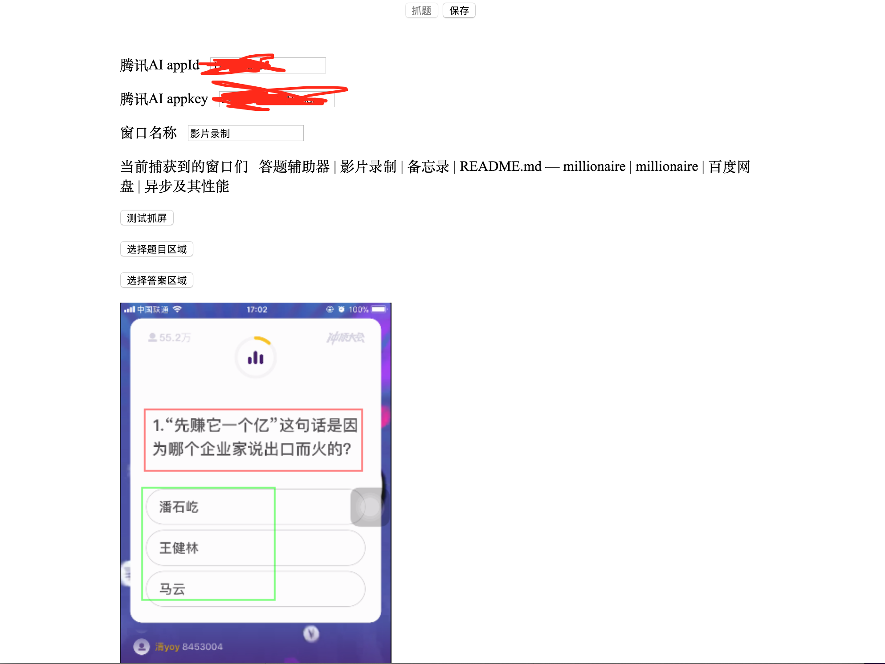

# millionaire

## 原理及使用
本工具是通过electron的接口来捕获桌面截图，然后通过腾讯AI提供的[OCR接口](https://ai.qq.com/doc/ocrgeneralocr.shtml)来识别题目及选项，直接在iframe中利用百度搜索对应的题目及项目。

具体的使用步骤是：
- 将你的手机投影到pc上或者在pc上使用模拟器来打开对应的答题app。windows下推荐使用模拟器，mac的话可以使用quick timerplayer来投影手机，具体步骤可以google一下。

- 配置对应的appId、appKey及题目和选项区域。

- 抓题
当题目出现后，需手动点击抓题按钮，方才开始抓题并搜索，还是比较容易能直接在搜索结果里找到答案的。

## 常见问题
- 设置中的appId和appKey如何获取？
因为程序中OCR是调用腾讯AI开发平台的接口，所以需要使用者前往[腾讯AI开发平台](https://ai.qq.com/)申请。

- 该程序支持哪几类答题APP？
因为是采用OCR的方式，所以理论上是都能支持，但是需要不同手机型号及不同app他们对应的题目和选项的区域不一致，所以需要你手动配置下答题区域和选项区域。

- 识别速度如何？
因为OCR走的是HTTP接口，并且会调用百度搜索，所以会和网速有很大的关系，网速良好的情况一般是5s左右能出搜索结果。tips：使用时尽量少开窗口，手机的镜像屏幕尽量是只有手机画面，而没有多余的画面。

- 不会electron怎么办？
这是就体现了使用electron的好处的了，我打包了windows下的包，上传在百度云上，链接:https://pan.baidu.com/s/1brbbWpL  密码:igp0。不过由于我的是mac环境，所以没有验证window下的速度及有效性，so，有问题可以反馈给我。